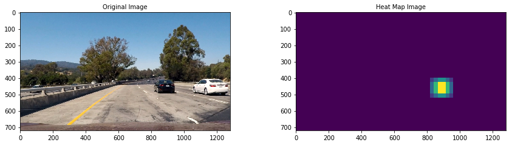
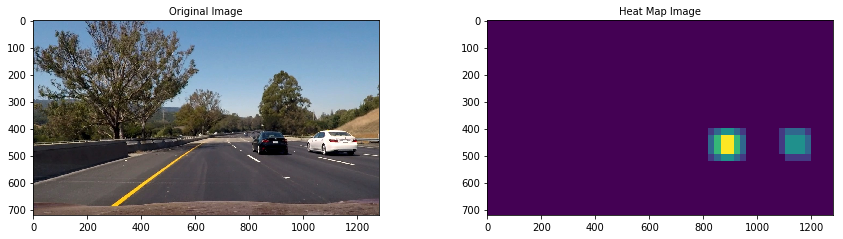
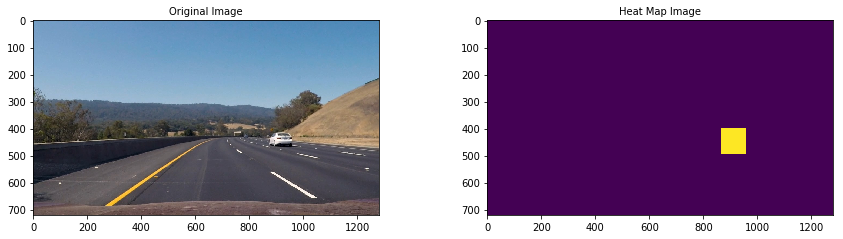
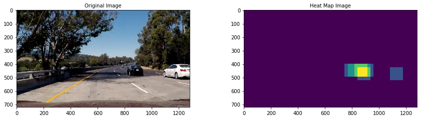
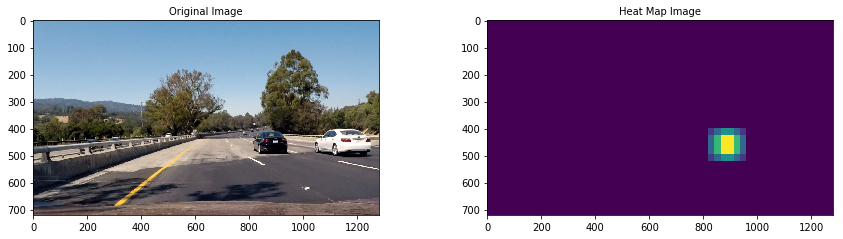
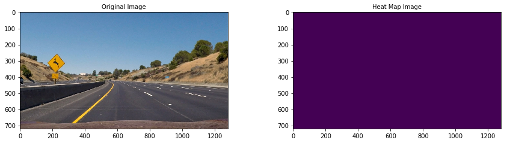

[//]: # (Image References)
[image_0]: ./misc/vehicleDetection.gif
# Vehicle Detection
![alt text][image_0] 
 
The Project
---

The goals / steps of this project are the following:

* Perform a Histogram of Oriented Gradients (HOG) feature extraction on a labeled training set of images and train a classifier Linear SVM classifier
* Optionally, you can also apply a color transform and append binned color features, as well as histograms of color, to your HOG feature vector. 
* Note: for those first two steps don't forget to normalize your features and randomize a selection for training and testing.
* Implement a sliding-window technique and use your trained classifier to search for vehicles in images.
* Run your pipeline on a video stream (start with the test_video.mp4 and later implement on full project_video.mp4) and create a heat map of recurring detections frame by frame to reject outliers and follow detected vehicles.
* Estimate a bounding box for vehicles detected.

Here are links to the labeled data for [vehicle](https://s3.amazonaws.com/udacity-sdc/Vehicle_Tracking/vehicles.zip) and [non-vehicle](https://s3.amazonaws.com/udacity-sdc/Vehicle_Tracking/non-vehicles.zip) examples to train your classifier.  These example images come from a combination of the [GTI vehicle image database](http://www.gti.ssr.upm.es/data/Vehicle_database.html), the [KITTI vision benchmark suite](http://www.cvlibs.net/datasets/kitti/), and examples extracted from the project video itself.   You are welcome and encouraged to take advantage of the recently released [Udacity labeled dataset](https://github.com/udacity/self-driving-car/tree/master/annotations) to augment your training data.  

# Perform a Histogram of Oriented Gradients (HOG) feature extraction on a labeled training set of images and train a classifier Linear SVM classifier
# Data Set
The data set images come from a combination of the [GTI vehicle image database](http://www.gti.ssr.upm.es/data/Vehicle_database.html) and [KITTI vision benchmark suite](http://www.cvlibs.net/datasets/kitti/). 
11760 images of vehicles(8792) and non-vehicles(8968) is used to train a classifier.

Here are links to the labeled full data of [vehicle](https://s3.amazonaws.com/udacity-sdc/Vehicle_Tracking/vehicles.zip) and [non-vehicle](https://s3.amazonaws.com/udacity-sdc/Vehicle_Tracking/non-vehicles.zip)


## Feature Parameters 
Below are the parameters used to extract features to train the classifier.
* color_space: RGB
* spatial_size: (32,32)
* hist_bins: 32
* orient: 9
* pix_per_cell: 8
* cell_per_block: 2
* hog_channel: 'ALL'
* spatial_feat: True
* hist_feat: True

### Feature Extraction Source Code
```python
def extract_features(imgs, color_space='RGB', spatial_size=(32, 32),
                     hist_bins=32, orient=9,
                     pix_per_cell=8, cell_per_block=2, hog_channel='ALL',
                     spatial_feat=True, hist_feat=True, hog_feat=True):
    """
    Extract features from a list of images
    :param imgs: List of images
    :param color_space: RGB
    :param spatial_size: (32,32)
    :param hist_bins: 32
    :param orient: 9
    :param pix_per_cell: 8
    :param cell_per_block: 2
    :param hog_channel: 'ALL'
    :param spatial_feat: True
    :param hist_feat: True
    :param hog_feat: True
    :return: List of features
    """

    features = []

    for file in imgs:
        file_features = []
        image = mpimg.imread(file)
        # apply color conversion if other than 'RGB'
        if color_space != 'RGB':
            if color_space == 'HSV':
                feature_image = cv2.cvtColor(image, cv2.COLOR_RGB2HSV)
            elif color_space == 'LUV':
                feature_image = cv2.cvtColor(image, cv2.COLOR_RGB2LUV)
            elif color_space == 'HLS':
                feature_image = cv2.cvtColor(image, cv2.COLOR_RGB2HLS)
            elif color_space == 'YUV':
                feature_image = cv2.cvtColor(image, cv2.COLOR_RGB2YUV)
            elif color_space == 'YCrCb':
                feature_image = cv2.cvtColor(image, cv2.COLOR_RGB2YCrCb)
        else:
            feature_image = np.copy(image)

        if spatial_feat:
            spatial_features = bin_spatial(feature_image, size=spatial_size)
            file_features.append(spatial_features)
        if hist_feat:
            # Apply color_hist()
            hist_features = color_hist(feature_image, nbins=hist_bins)
            file_features.append(hist_features)
        if hog_feat:

            # Call get_hog_features() with vis=False, feature_vec=True
            if hog_channel == 'ALL':
                hog_features = []
                for channel in range(feature_image.shape[2]):
                    hog_features.append(get_hog_features(feature_image[:, :, channel],
                                                         orient, pix_per_cell, cell_per_block,
                                                         vis=False, feature_vec=True))
                hog_features = np.ravel(hog_features)
            else:
                hog_features = get_hog_features(feature_image[:, :, hog_channel], orient,
                                                pix_per_cell, cell_per_block, vis=False, feature_vec=True)
            file_features.append(hog_features)
        features.append(np.concatenate(file_features))
    return features
    
    
vehicle_features = extract_features(vehicles)
non_vehicle_features = extract_features(non_vehicles)

```
## Training the Classifier
A C-Support VectorClassifier (SVC)  with RBF kernel is used to train the classifier.
The feature sets are randomized and break into Training(80%) and Testing(20%) set.
The training result  gives an accuracy of *99*%

### Split Data Source Code
```python
def split_data(vehicle_features,non_vehicle_features):
    """
    Split the data into randomized training and test sets
    :param vehicle_features:
    :param non_vehicle_features:
    :return:
    """
    x = np.vstack((vehicle_features, non_vehicle_features)).astype(np.float64)
    # Fit a per-column scaler
    x_scaler = StandardScaler().fit(x)
    # Apply the scaler to X
    scaled_X = x_scaler.transform(x)

    # Define the labels vector
    y = np.hstack((np.ones(len(vehicle_features)), np.zeros(len(non_vehicle_features))))

    rand_state = np.random.randint(0, 100)
    X_train, X_test, y_train, y_test = train_test_split(scaled_X, y, test_size=0.2, random_state=rand_state)
    return X_train, X_test, y_train, y_test
```

### Train Classifier Source Code
```python
def train_with_svc(X_train,y_train):
    """
    Train with Support Vector Classification
    :param X_train:
    :param y_train:
    :return: svc
    """
    svc = SVC(kernel='rbf')
    svc.fit(X_train, y_train)
    return svc
```
# Implement a sliding-window technique and use your trained classifier to search for vehicles in images.
## Sliding Window

 A Sliding Window search is used to speed up the process of searching vehicles in the video.
 The limit search is set to 400 and 656, removing all scenery that are not needed.
* `ystart` = 400
* `ystop` = 656

## Heat Maps
Here is the heat map for all test images
### Test Image 1

### Test Image 2

### Test Image 3

### Test Image 4

### Test Image 5

### Test Image 6



# Discussion
Support Vector Machines works well in complicated domains where there is
clear margin of separation but don't perform well in very large data sets
because the training time happens to be cubic in the size of the data set.
They also don't work well with lots of noise.Therefore when the class are
overlapping we have to count independent evidence.That's where then a Naive
Bayes classifier would be better or a Fully Convolutional Network such as
the one use in this project,[Deep Learning Drone Simulator](https://github.com/fouliex/DeepLearningDroneSimulator)
